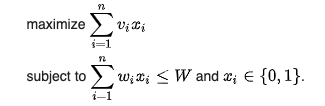
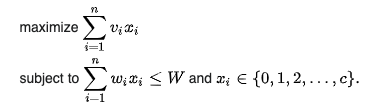
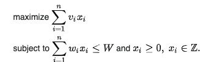

##### Required packages

***pandoc***

***rmarkdown***

***ggplot2***

### Knapsack Problem
**Introduction**
The Knapsack Problem is a famous **Dynamic Programming** Problem that falls in the optimization category.
It derives its name from a scenario where, given a set of items with specific weights and assigned values, the goal is to **maximize** the value in a knapsack while remaining within the weight constraint. Each item can only be selected once, as we don’t have multiple quantities of any item.

There are 3 different type of Knapsack Problems.

#### O-1 Knapsack Problem
The most common problem being solved is the 0-1 knapsack problem, which restricts the number xi of copies of each kind of item to zero or one. Given a set of n items numbered from 1 up to n, each with a weight and a value v, along with a maximum weight capacity W,



#### Bounded Knapsack Problem (BKP)
The bounded knapsack problem removes the item limit. It means, more that one item can be added to the knapsack.



#### Unbounded Knapsack Problem (UKP)
The unbound knapsack problme places no upper bound on the number of copies of each kind of item and can be formulated as above except for that the only restriction on x is that it is a non-negative integer.


#### 1.1.2 Brute Force Knapsack

#### 1.1.3 Dynamic Knapsack

#### 1.1.4 Greedy Heuristic Knapsack


```{r, include = FALSE}
knitr::opts_chunk$set(
  collapse = TRUE,
  comment = "#>"
)
```

```{r setup}
library(lab06)
```
